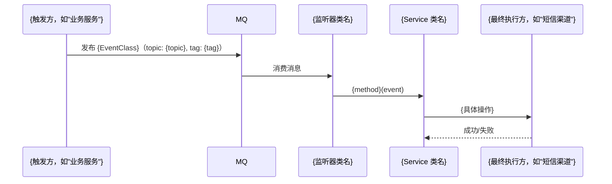

# docs/flows.md 生成指南

flows.md 是文档中对跨服务协作最有价值的一份。它回答的问题是：

- **一次完整的业务请求，从哪里开始，经过哪些步骤，最终到哪里结束？**
- **如果我修改了某个地方，会影响哪些流程？**

business.md 说的是规则，contracts.md 说的是接口，flows.md 说的是**这些规则和接口在真实业务中是怎么串联起来的**。

## 如何识别需要描述的流程

从以下入口识别主要业务流程：

1. **MQ 监听器**：每个监听器代表一个"外部触发入口"，从它开始往下追调用链
2. **HTTP 控制器**：每个 Controller 方法是一个"请求入口"
3. **定时任务**：`@Scheduled` 方法是"时间触发入口"
4. **Service 层的主要公开方法**：梳理核心业务操作

优先描述：
- 最核心的业务流程（高频、影响面广）
- 涉及多个组件协作的复杂流程
- 有延迟/异步处理的流程（容易出问题、难以追踪）

## 输出模板

```markdown
# 业务执行流程

## {流程名称，如"场景通知发布流程"}

**触发入口**：{谁触发，如"外部服务调用 NotifyScenePublishSupport#publish" 或 "MQ消息到达 topic_xxx"}  
**输出结果**：{最终效果，如"用户收到短信" 或 "记录写入数据库"}

### 执行序列



### 步骤说明

| 步骤 | 组件 | 动作 | 备注 |
|------|------|------|------|
| 1 | {触发方} | {做了什么} | {关键参数或约束} |
| 2 | {监听器} | {做了什么} | |
| 3 | {Service} | {做了什么} | |

### 异常处理

| 异常场景 | 处理方式 | 影响范围 |
|---------|---------|---------|
| {如"渠道调用超时"} | {如"不重试，记录失败状态"} | {如"只影响当前消息，不影响其他流程"} |

### 关键影响点

修改以下地方会影响此流程：

- **{类名/接口名}**：{修改它会导致什么变化，影响哪些上下游}
- **{MQ Topic/Tag 常量}**：{如果改名，需要同步更新消费方和发布方}
- **{DTO 字段}**：{如果加减字段，需要通知所有发布方}

---

## {流程名称2}

...（同上结构）
```

## 延迟/异步流程的特殊说明

对于包含延迟消息的流程，需要额外说明：

```markdown
### 延迟处理

本流程中 {步骤N} 使用了延迟消息（delay_topic），需注意：
- 延迟时间：{Duration，如 "Duration.ofMinutes(10)"}
- 发布后不可撤销：如果业务状态在延迟期间发生变化，需在消费时做幂等判断
- 延迟精度：{如 "毫秒级（RocketMQ 5.x DeliverTimeMills）"}
```

## 写作原则

- mermaid 序列图只画核心路径，不要画每一行代码
- "关键影响点"是这份文档最重要的部分，认真填写
- 如果某个步骤的实现细节复杂，写"详见 business.md - {章节名}"，不要在这里重复
- 如果来源服务不确定，在触发方标注"（来源待确认）"
