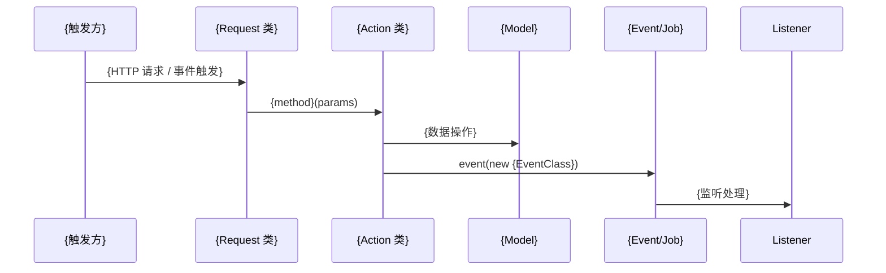

# docs/{module}/flows.md 生成指南

flows.md 是文档中对跨模块协作最有价值的一份。它回答的问题是：

- **一次完整的业务请求，从哪里开始，经过哪些步骤，最终到哪里结束？**
- **如果我修改了某个地方，会影响哪些流程？**

business.md 说的是规则，contracts.md 说的是接口，flows.md 说的是**这些规则和接口在真实业务中是怎么串联起来的**。

## 如何识别需要描述的流程

从以下入口识别主要业务流程：

1. **API 路由**：每条 API 路由是一个"请求入口"，从 Request 类往下追 Action 调用链
2. **事件监听器**：每个 Listener 代表一个"事件触发入口"，从它开始往下追调用链
3. **队列任务**：每个 Job 是一个"异步处理入口"
4. **Artisan 命令**：Command 是"命令行触发入口"
5. **定时调度**：Kernel schedule 中注册的定时任务

优先描述：
- 最核心的业务流程（高频、影响面广）
- 涉及多个 Action/模块协作的复杂流程
- 有事件级联/异步队列处理的流程（容易出问题、难以追踪）
- 涉及跨模块调用的流程

## 输出模板

```markdown
# 业务执行流程

## {流程名称，如"商品回收审核流程"}

**触发入口**：{谁触发，如"API POST /api/v1/recycle/audit" 或 "RecycleGoodsEvent 事件"}
**输出结果**：{最终效果，如"更新回收单状态，发送通知" 或 "记录写入数据库，触发下游事件"}

### 执行序列



### 步骤说明

| 步骤 | 组件 | 动作 | 备注 |
|------|------|------|------|
| 1 | {Request/Listener} | {做了什么：参数验证/接收事件} | {关键参数或约束} |
| 2 | {Action} | {做了什么：业务逻辑} | {调用了哪些依赖} |
| 3 | {Model} | {做了什么：数据持久化} | {涉及的表} |
| 4 | {Event/Job} | {做了什么：触发异步处理} | {下游影响} |

### 异常处理

| 异常场景 | 处理方式 | 影响范围 |
|---------|---------|---------|
| {如"参数校验失败"} | {如"返回 422 错误"} | {只影响当前请求} |
| {如"Action 抛出业务异常"} | {如"事务回滚，返回错误信息"} | {不影响其他流程} |
| {如"Job 执行失败"} | {如"自动重试 3 次后标记失败"} | {延迟处理，最终一致} |

### 关键影响点

修改以下地方会影响此流程：

- **{Action 类/方法}**：{修改它会导致什么变化}
- **{Event 类}**：{如果修改事件数据结构，需要同步更新所有 Listener}
- **{Model 字段}**：{如果加减字段，影响哪些上下游}
- **{跨模块依赖}**：{如果引用了其他模块的 Action/Model，修改那边会影响这里}

---

## {流程名称2}

...（同上结构）
```

## 跨模块流程的特殊说明

对于涉及跨模块调用的流程，需要额外标注：

```markdown
### 跨模块调用

本流程涉及以下跨模块交互：
- **步骤 N** 调用了 `{OtherModule}\Action\{Class}::{method}()`
  - 原因：{为什么需要跨模块调用}
  - 风险：{如果对方模块修改该方法，本流程会受影响}
```

## 事件级联流程的特殊说明

对于包含事件级联的流程，需要展示完整的事件链：

```markdown
### 事件级联

本流程触发以下事件链：

{EventA} → ListenerA1 → {EventB} → ListenerB1 → {最终动作}
                      → ListenerA2 → dispatch({JobX})

说明：
- {EventA} 被 N 个 Listener 处理，其中 ListenerA1 会触发下游事件 {EventB}
- 如果修改 {EventA} 的数据结构，影响 N 个 Listener
```

## 写作原则

- mermaid 序列图只画核心路径，不要画每一行代码
- "关键影响点"是这份文档最重要的部分，认真填写
- 如果某个步骤的实现细节复杂，写"详见 business.md - {章节名}"，不要在这里重复
- Request 类在 weiran 框架中同时承担路由绑定和请求处理的角色，不同于传统 Controller
- 优先描述跨模块流程，因为这些流程最容易因为修改一处而影响多处
