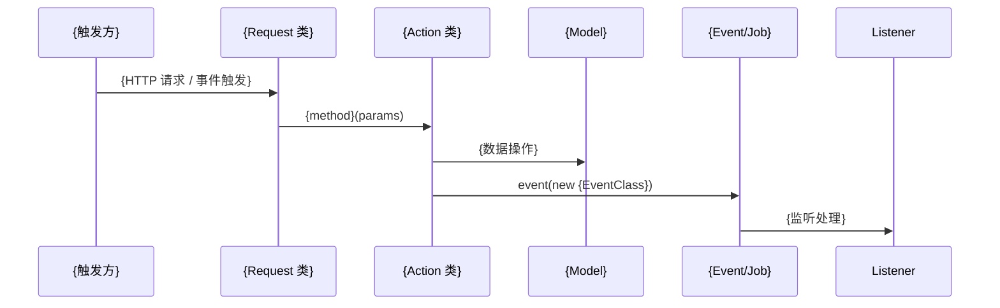

# 业务执行流程

## {流程名称，如"商品回收审核流程"}

**触发入口**：{谁触发，如"API POST /api/v1/recycle/audit" 或 "RecycleGoodsEvent 事件"}
**输出结果**：{最终效果，如"更新回收单状态，发送通知" 或 "记录写入数据库，触发下游事件"}

### 执行序列

### 步骤说明

| 步骤 | 组件                 | 动作               | 备注        |
|----|--------------------|------------------|-----------|
| 1  | {Request/Listener} | {做了什么：参数验证/接收事件} | {关键参数或约束} |
| 2  | {Action}           | {做了什么：业务逻辑}      | {调用了哪些依赖} |
| 3  | {Model}            | {做了什么：数据持久化}     | {涉及的表}    |
| 4  | {Event/Job}        | {做了什么：触发异步处理}    | {下游影响}    |

### 异常处理

| 异常场景               | 处理方式               | 影响范围        |
|--------------------|--------------------|-------------|
| {如"参数校验失败"}        | {如"返回 422 错误"}     | {只影响当前请求}   |
| {如"Action 抛出业务异常"} | {如"事务回滚，返回错误信息"}   | {不影响其他流程}   |
| {如"Job 执行失败"}      | {如"自动重试 3 次后标记失败"} | {延迟处理，最终一致} |

### 关键影响点

修改以下地方会影响此流程：

- **{Action 类/方法}**：{修改它会导致什么变化}
- **{Event 类}**：{如果修改事件数据结构，需要同步更新所有 Listener}
- **{Model 字段}**：{如果加减字段，影响哪些上下游}
- **{跨模块依赖}**：{如果引用了其他模块的 Action/Model，修改那边会影响这里}

---

## {流程名称2}

...（同上结构）