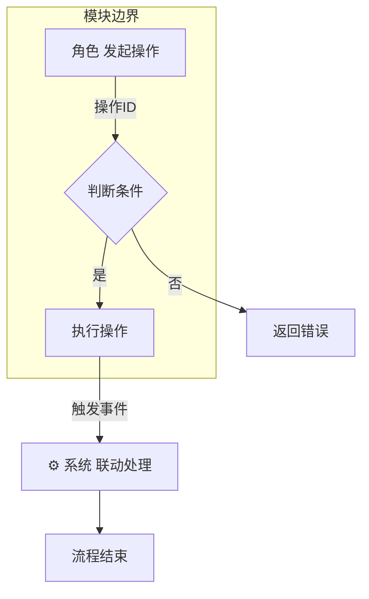

# 业务能力分析技能

## 目标
按业务能力维度聚合所有 Action 操作项，输出结构化的业务分析报告，包含角色权限、操作清单、业务流程图和边界说明。

## 工作流程

技能执行必须按以下五个步骤顺序进行，每一步的输出是下一步的输入，不可跳过或合并。

### 步骤一：全量扫描 Action 类和方法

扫描项目中所有 Action 类文件，提取基础信息，输出到 `docs/actions.json`。

```bash
# 1. 确保输出目录存在
mkdir -p docs && mkdir -p docs/biz

# 2. 全量发现所有 Action 文件（排除测试目录）
find modules -path "*Action/*.php" -type f -not -path "*tests*" | sort > /tmp/action_list.txt

# 3. 按模块统计数量，确认扫描完整性
echo "=== 各模块 Action 数量统计 ==="
for dir in Account Finance General Middleman Misc Sales User; do
  count=$(find modules/${dir,}/src/Action -name "*.php" -type f 2>/dev/null | wc -l | tr -d ' ')
  echo "$dir: $count"
done
echo "=============================="
echo "Total: $(cat /tmp/action_list.txt | wc -l | tr -d ' ') 个 Action 文件"
```

批量解析每个 Action 文件，输出结构化 JSON 到 `docs/actions.json`：

```json
[
  {
    "method": "Order#ActOrderCreate@create",
    "comment": "创建订单",
    "module": "Order"
  }
]
```

- **method** 格式：`模块#Class@方法名`，每个 Action 的每个 public 方法（排除 `__construct` 和纯框架方法）占一条记录
- **comment** 提取 PHP 类注释中的 `@description` 或首段说明文字
- **module** 模块名：从文件路径第二段提取（如 `modules/Order/src/Action/...` → `Order`）

> ⚠️ 此步骤完成后必须将结果写入 `docs/actions.json`，后续步骤以此文件为基础追加字段。

### 步骤二：扫描路由提取 URL 映射

扫描各模块的路由定义文件，提取 URL、中间件与控制器方法/Action 方法的映射关系，输出到 `docs/url-map.json`。

此步骤复用 `/repo-api-scan` 的路由扫描逻辑，具体流程如下：

#### 2.1 解析 RouteServiceProvider（建立前缀映射）

遍历 `modules/*/src/(Http|http)/RouteServiceProvider.php`，建立「路由文件 → 前缀信息」映射表。

```bash
# 1. 发现所有 RouteServiceProvider
find modules -name "RouteServiceProvider.php" -type f -not -path "*tests*" | sort > /tmp/route_provider_list.txt

# 2. 统计数量
echo "RouteServiceProvider 数量: $(cat /tmp/route_provider_list.txt | wc -l | tr -d ' ')"
```

**prefix 解析规则：**

| 格式 | 处理方式 | 示例 |
|------|---------|------|
| 静态字符串 | 直接提取 | `'prefix' => 'api/web/order/v1'` → 原样保留 |
| 变量拼接 | `$this->prefix` 替换为 `'mgr-page'` | `'prefix' => $this->prefix . '/order'` → `'mgr-page/order'` |

**URL 拼接规则：**
```
完整前缀不以 / 开头则添加 /
路由路径不以 / 开头且前缀不以 / 结尾则添加 /
例：'mgr-page/order' + 'list' → '/mgr-page/order/list'
```

> ⚠️ `RouteServiceProvider` 中的 `require_once` 仅是路由文件的加载机制，不是实际接口，不可统计为映射记录。

#### 2.2 扫描路由文件（实际提取映射）

路由文件位于各模块的 `Routes/` 或 `routes/` 目录下。

**处理嵌套 group：** 路由文件内可能有多层 `$route->group()` 嵌套，需逐层解析，累积完整 prefix 链、namespace、middleware。

```php
// 示例：嵌套 group
$route->group(['prefix' => 'admin', 'middleware' => 'backend-auth'], function() {
    $route->group(['prefix' => 'order', 'namespace' => 'Order\Http\Request\Backend'], function() {
        $route->get('list', [OrderController::class, 'index']); // 实际路径: /admin/order/list
    });
});
```

**支持两种路由格式：**

| 格式 | 示例 |
|------|------|
| 数组格式 | `$route->get('path', [Controller::class, 'action'])` |
| 字符串格式 | `$route->get('path', 'Controller@action')` |

**扫描步骤：**
1. 根据路由文件路径查找映射表，获取外层 prefix
2. 解析文件内所有嵌套的 `$route->group()`，累积完整 prefix 链
3. 解析每个 group 内的 `namespace`
4. 解析每个 group 内的 `middleware`
5. 提取 HTTP 方法（get/post/put/delete/patch/any）和 URI 路径
6. 拼接完整 URL = 外层 prefix + 内层累积 prefix + 路由路径
7. 记录控制器完整类名（含 namespace）和方法名
8. 关联到 Action 方法（通过 Controller 中的 Action 实例化/调用关系）

#### 2.3 Controller → Action 关联

对于每条路由记录，需要追溯到对应的 Action 方法：
1. **直接实例化**：Controller 方法中 `new ActXxx()` → 提取 Action 类名
2. **静态调用**：`ActXxx::method()` → 提取 Action 类名和方法
3. **构造方法注入**：Controller 构造函数参数类型推断

将 Action 方法转换为 `module#Class@method` 格式：
- 模块名从 Action 文件路径第二段提取（如 `modules/Order/src/Action/...` → `Order`）
- Class 为 Action 类名（不含命名空间）
- method 为 Action 中被调用的方法名

#### 2.4 输出格式

输出结构化 JSON 到 `docs/url-map.json`：

```json
[
  {
    "url": "/mgr-page/order/list",
    "middleware": "backend-auth,auth",
    "method": "Order#ActOrderList@index"
  },
  {
    "url": "/api/order/create",
    "middleware": "auth,pam",
    "method": "Order#ActOrderCreate@create"
  }
]
```

- **url**: 完整路由路径，以 `/` 开头
- **middleware**: 中间件列表，逗号分隔
- **method**: 格式为 `模块#Action类@方法名`，若路由直接指向 Controller 而非 Action，则格式为 `模块#Controller类@方法名`

> ⚠️ 此步骤只负责生成 `docs/url-map.json`，不修改 `docs/actions.json`。

### 步骤三：反查 URL 映射补充 API 信息

读取 `docs/actions.json` 和 `docs/url-map.json`，通过 method 字段匹配为每条 Action 记录补充 `url` 和 `middleware` 字段。

匹配规则：
1. **精确匹配**：`docs/actions.json` 中的 `method` 字段与 `docs/url-map.json` 中的 `method` 字段完全一致
2. **类名模糊匹配**：精确匹配未命中时，提取 Class 名在 `url-map.json` 中搜索所有该 Action 类的路由，取第一条
3. **未匹配标记**：无法匹配的记录 `url` 标记为 `null`，`middleware` 标记为 `null`（可能为事件触发/回调/定时任务等非路由入口）

补充后的 `docs/actions.json` 每条记录形如：

```json
{
  "method": "Order#ActOrderCreate@create",
  "comment": "创建订单",
  "module": "Order",
  "url": "/api/order/create",
  "middleware": "auth,pam"
}
```

> ⚠️ 此步骤为原地追加字段，不改变已有字段值，不新增或删除记录。

### 步骤四：拆分业务域与角色关联

读取 `docs/actions.json`，根据方法语义、模块、角色标识拆分业务域和用户角色，输出到 `docs/biz.json`。

角色识别规则：

| 角色标识 | 识别规则 | 说明 |
|---------|---------|------|
| 🏪 商户 | `WebPamTrait` | 商家/店主，商户端操作 |
| 👷 打手 | 命名空间 `*\\Soldier\\*` | 代练员/员工端操作 |
| 👨‍💼 后台 | `ActBe*` 类名前缀 / Backend命名空间 | 平台管理员 |
| 👤 用户 | `PamTrait` 但非上述 | 终端用户/号主 |
| ⚙️ 系统 | 静态方法 / 控制器未直接调用 | 事件触发/回调/定时任务 |
| 👔 代理人 | `Middle*` / `Agent*` 命名空间 | 代理人角色 |
| 👨‍💼 客服 | `Kf*` / `Chat*` 命名 | 客服角色 |

业务域聚类规则（参考，实际以方法语义为准）：

| 业务域 | 包含的操作类型 |
|-------|---------------|
| 订单创建与维护 | 订单创建、编辑、删除、标签、备注 |
| 订单发布管理 | 发布三方、撤销、重新发布、防挂 |
| 订单接单与进度 | 接单大厅、抢单、上传截图、申请验收 |
| 订单异常处理 | 问题订单、撤单、退款、客服介入 |
| 收支审核管理 | 利润核算、审核通过、金额调整、数据导入 |
| 支付与结算 | 创建支付单、支付回调、线下确认、转账 |
| 打手招募与管理 | 入职、保证金、分组、标签、黑名单 |
| 商户配置管理 | 游戏配置、来源渠道、导入模板、预警价格 |
| 即时通讯 | 会话管理、消息发送、群组管理 |
| 数据统计 | 大盘统计、订单统计、财务统计、绩效 |
| 系统配置 | 游戏大区、属性、SPU、合同模板、短信 |

`biz.json` 组织形式：

```json
{
  "domains": [
    {
      "name": "订单创建与维护",
      "role_access": ["🏪 商户", "⚙️ 系统"],
      "methods": [
        "Order#ActOrderCreate@create",
        "Order#ActOrderEdit@edit"
      ]
    }
  ]
}
```

- **domains**: 业务域列表
- **name**: 业务域名称
- **role_access**: 可访问此业务域的角色列表
- **methods**: 属于此业务域的方法列表（引用 `docs/actions.json` 中的 `method` 值）

> ⚠️ 一个方法只能归属一个业务域，业务域之间互斥。

### 步骤五：生成业务域文档

根据 `biz.json` 中的业务域列表，逐个生成业务域文档，输出到 `biz/{序号}-{业务域}.md`。

文档命名规则：序号从 `01` 开始递增，业务域名称使用中文，如：
- `biz/01-订单创建与维护.md`
- `biz/02-订单发布管理.md`
- `biz/03-支付与结算.md`

每个业务域文档格式：

```markdown
# {业务域名称}

**业务边界：** {说明此业务能力的上游输入、下游输出、跨模块交互、外部依赖}

**业务角色：** {列出所有可执行操作的角色}

| 操作名称 | 操作ID | API路径 | 中间件 | 关联事件 | 操作入口 |
|---------|--------|---------|--------|---------|---------|
| {中文名称} | {Module.ActClass.method} | {url} | {middleware} | {Event名称 / -} | {控制器 / 事件触发} |

**业务流程图：**



**边界说明：**
1. {模块A} 与 {模块B} 通过事件解耦，无直接依赖
2. 外部系统：{支付宝/三方平台等} 通过回调与系统交互
```

---

### 附：深度分析 Action 细节

在执行步骤四和步骤五时，对每个 Action 进行深度分析：
- 方法签名和参数含义
- 方法内的核心业务逻辑
- 触发的事件及其含义
- 数据库操作类型（读/写/事务）
- 跨模块调用关系

---

## 分析原则

### 操作项识别规则
✅ **保留**：所有改变系统状态的业务操作  
✅ **保留**：查询类操作（如 getData、getProgress）  
❌ **排除**：`__construct`、`getError`、`getResult`、`setPam` 等纯框架方法  
✅ **保留但标注辅助**：get/set 类业务相关方法

### 流程图绘制原则
1. 从用户触发开始，到系统状态稳定结束
2. 明确标注每个节点的执行者（角色）
3. 使用 subgraph 标注模块边界
4. 箭头上标注操作ID
5. 菱形表示决策分支

### 业务边界识别
- 模块边界：跨模块调用 / 事件监听
- 系统边界：调用外部 API（支付宝、三方平台）
- 权限边界：不同角色操作的隔离点
- 数据边界：商户数据隔离（parent_id）

---

## 质量验收环节（报告输出后必须执行）

### 验收 1：文件覆盖度校验

```bash
# 对比 docs/actions.json 记录数与实际扫描的 Action 文件数
echo "=== 覆盖度校验 ==="
scanned_count=$(find modules -path "*Action/*.php" -type f -not -path "*tests*" | wc -l | tr -d ' ')
json_count=$(cat docs/actions.json | jq 'length')
echo "扫描到的 Action 文件总数: $scanned_count"
echo "docs/actions.json 记录数: $json_count"
```

⚠️ **验收标准**：核心业务模块（Account/Finance/Middleman/Misc/Sales）覆盖度必须 ≥ 90%

---

### 验收 2：操作项完整性校验

```bash
# 校验 biz.json 中的方法是否全部来自 docs/actions.json
echo "=== 操作项完整性校验 ==="
action_total=$(cat docs/actions.json | jq 'length')
biz_total=$(cat biz.json | jq '[.domains[].methods | length] | add')
echo "docs/actions.json 总方法数: $action_total"
echo "biz.json 关联的方法总数: $biz_total"
```

⚠️ **验收标准**：
1. 排除纯 get/set 辅助方法后，业务操作方法覆盖率 ≥ 80%
2. 每个业务能力域下的操作项数，与该域下实际方法数偏差 ≤ 20%

---

### 验收 3：文档完整性校验

```bash
# 校验 biz.json 中的每个业务域是否都有对应的文档
echo "=== 文档完整性校验 ==="
domain_count=$(cat biz.json | jq '.domains | length')
doc_count=$(ls biz/*.md 2>/dev/null | wc -l | tr -d ' ')
echo "biz.json 业务域数量: $domain_count"
echo "biz/ 目录下文档数量: $doc_count"
```

对于遗漏的业务域，必须补充对应文档。

对于遗漏的 Action，必须补充以下信息：
1. Action 所属业务能力域
2. 核心业务方法列表
3. 关联角色和操作入口
4. 是否需要补充流程图

---

### 验收 4：URL 映射完整性校验

```bash
# 校验 docs/url-map.json 记录数
echo "=== URL 映射完整性校验 ==="
url_map_count=$(cat docs/url-map.json | jq 'length')
action_with_url=$(cat docs/actions.json | jq '[.[] | select(.url != null)] | length')
echo "docs/url-map.json 映射记录数: $url_map_count"
echo "docs/actions.json 已关联 URL 的方法数: $action_with_url"
```

⚠️ **验收标准**：核心业务模块 Action 的 URL 关联率 ≥ 80%

---

### 验收 5：最终统计输出

报告末尾必须包含以下统计信息：

```
✅ 扫描到的 Action 文件总数：XXX
✅ docs/actions.json 记录数：XXX
✅ docs/url-map.json 映射记录数：XXX
✅ 总操作项（方法）数量：XXX
✅ 有 API 路径的方法数：XXX
✅ 覆盖模块数：XXX
✅ biz.json 业务域数量：XXX
✅ biz/ 文档数量：XXX
✅ 角色类型数：XXX
✅ 业务流程图数量：XXX
📊 总体覆盖度：XX%
```

验收通过后，才能标记任务完成。
